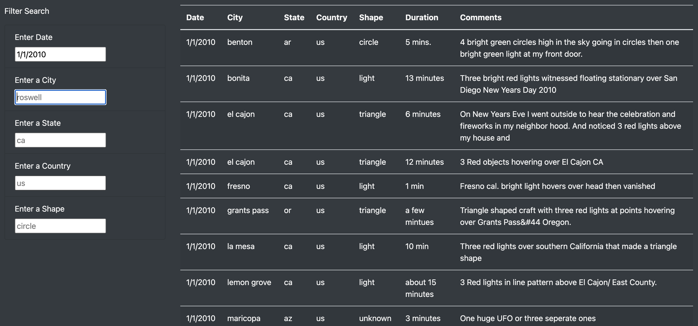

# UFOs

## Overview

It was requested to be able to provide a more in-depth analysis of UFO sightings by allowing users to use a web site to filter UFO sitings by not just a date, but also city, state, country and shape.

Modifications where made to the JavaScript and HTML to create additional table filters in addition to the original date filter.

## Results

The new filtering functionality on the UFO sightings website would be very useful, with the addition of city, state, country and shape filters. Here's an example of the original view on page load (see below).

##### *Original view on page load*

A person could start by narrowing down the UFO sightings by date. This would show someone if there were any similarities in sitings and provide clues if they might be related. Here's an example of filtering to January 1, 2010 (see below).

##### *View following filter to January 1, 2010*

Narrowing down the search further by country and state would show if there were similarities within a broader region. Here's an example of filtering to the United States and California (see below).

##### *View following filter to United States and California*

To get even more granular, narrowing sightings data by city would highlight similarities within a small geographic area. Here's an example of filtering to the city of El Cajon (see below).

##### *View following filter to El Cajon*

Finally, narrowing down by shape of the sighted object would highlight some pretty compelling similarities in the data. Here's an example of filtering to the "triangle" shape (see below).

##### *View following filter to triangle shape*

## Summary

The new page design does perform as expected, which is good. One drawback of the design is that after users have entered multiple entries in the various filter fields, they cannot clear all of those entries at once unless they reload the page. Users can delete each filter entry separately to get back to the original full view of the data, but this process is a bit tedious.

Two recommendations for further development include:
- For most of the filters, such as date, state, country and shape, the web site could use dropdown functionality instead of field entry. This would lessen the chance of users mispelling or using the wrong capilization when filtering the data. 
- Similar to the first recommendation, another solution instead of dropdown functionality would be to allow users to enter information that is close to an exact match and still have it filter, such as "El Cajon" instead of "el cajon" and "US" instead of "us", etc. Some updated Javascript logic could allow for this.
